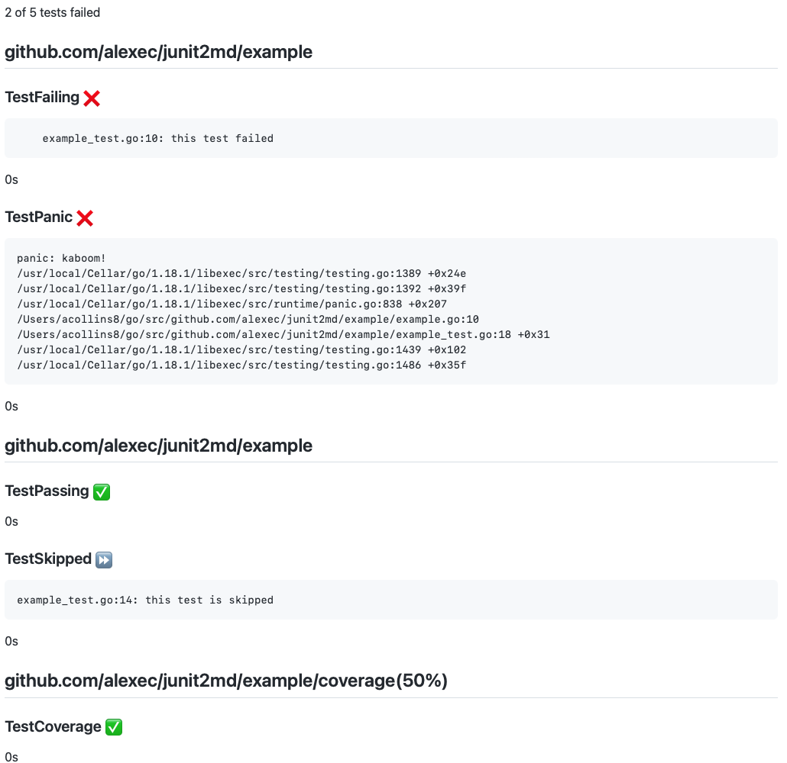

# junit2md

Convert Junit XML reports (`junit.xml`) into Markdown reports using Golang.

* Standalone binary.
* Failed tests are top, that's what's important.
* Looks ... good enough.

## Screenshot



## Usage

Here is an example that uses trap to always created the test report:

```bash
go install github.com/jstemmer/go-junit-report@latest
go install github.com/alexec/junit2md@latest

trap 'go-junit-report < test.out > junit.xml && junit2md < junit.xml > test-report.html' EXIT

go test -v -cover ./... 2>&1 > test.out
```

💡 Don't use pipes (i.e. `|`) in shell, pipes swallow exit codes. Use `<` and `>` which is POSIX compliant.

## Test

How to test this locally:

```bash
go test -v -cover ./... 2>&1 > test.out
go-junit-report < test.out > junit.xml 
go run . < junit.xml > test-report.md 
```
